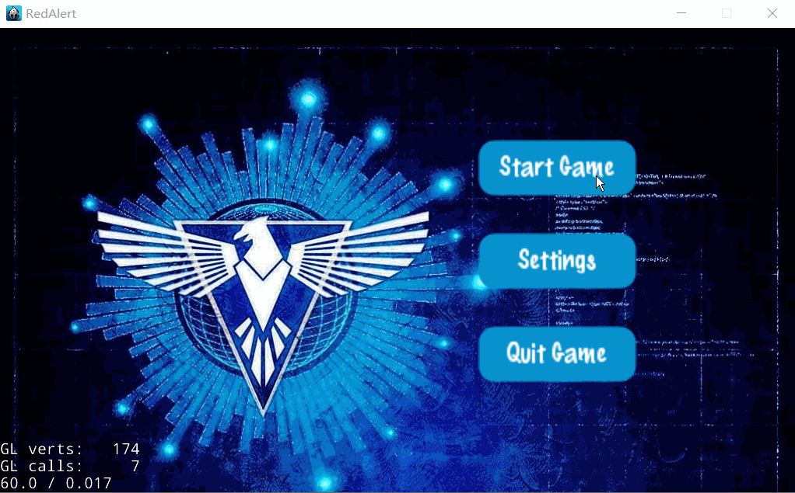
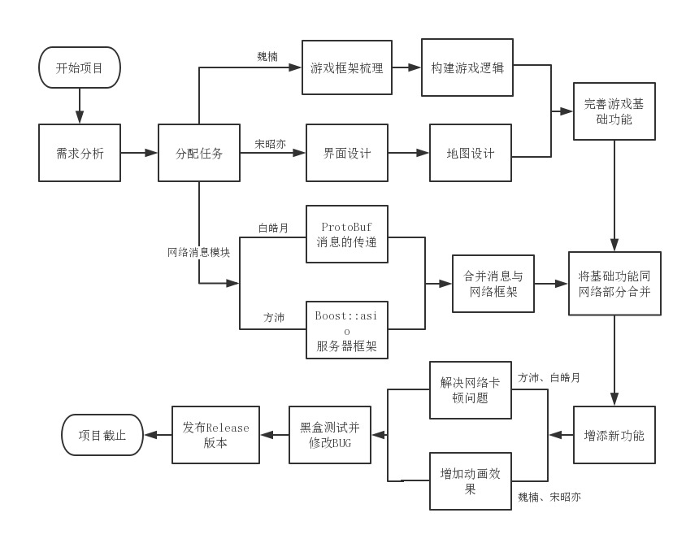
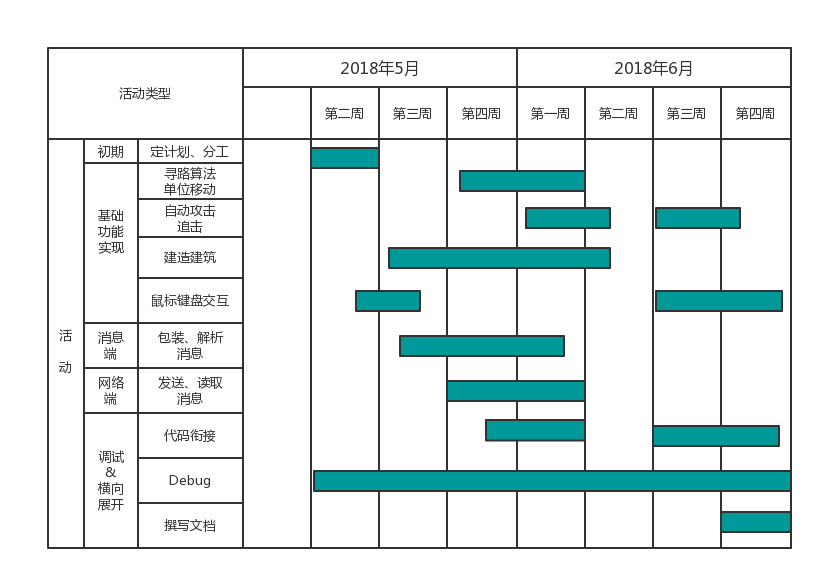
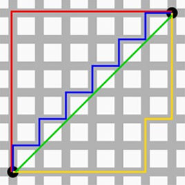

# RED ALERT
<!-- TOC -->

- [RED ALERT](#red-alert)
    - [游戏概述与游戏玩法](#游戏概述与游戏玩法)
        - [简介](#简介)
        - [游戏运行环境要求：](#游戏运行环境要求)
        - [游戏支持的操作](#游戏支持的操作)
        - [各兵种单位属性](#各兵种单位属性)
    - [游戏加载方式](#游戏加载方式)
        - [Server端口启动方式](#server端口启动方式)
        - [Client端口启动方式](#client端口启动方式)
        - [单一平台演示、测试方式](#单一平台演示测试方式)
    - [项目安排](#项目安排)
        - [项目分工及权值分配](#项目分工及权值分配)
        - [项目的开发流程](#项目的开发流程)
    - [评分项的完成度](#评分项的完成度)
        - [基础功能](#基础功能)
        - [基础功能外的可选功能](#基础功能外的可选功能)
        - [建造动画](#建造动画)
        - [移动动画](#移动动画)
        - [寻路算法](#寻路算法)
    - [C++规范的使用](#c规范的使用)
        - [C++特性的使用](#c特性的使用)
        - [C++11新特性的使用](#c11新特性的使用)
        - [代码规范](#代码规范)
    - [踩坑记录 & 避坑指南](#踩坑记录--避坑指南)
        - [cocos2d-x游戏设计模块 & TMX瓦片地图设计 & 精灵帧plist的制作](#cocos2d-x游戏设计模块--tmx瓦片地图设计--精灵帧plist的制作)
        - [Google ProtoBuf & Boost::Asio 网络消息模块](#google-protobuf--boostasio-网络消息模块)
    - [致谢](#致谢)

<!-- /TOC -->
## 游戏概述与游戏玩法
### 简介
Red Alert是一款即时战略(RTS)游戏，支持最多四人对战，可以实现局域网下的联机对抗，在游戏中玩家需要利用基地和各型建筑持续产生的资源来生产即战单位，在保证己方基地不被摧毁的前提下，摧毁敌方的基地以获得最终的胜利。


### 游戏运行环境要求：
* 运行平台：Windows
* 游戏最低硬盘空间：70 MB

### 游戏支持的操作

|支持的操作|对应的效果|
|:-:|:-:|
|点击主基地|呼出建造菜单|
|点击兵营|呼出警犬、士兵生产菜单|
|点击战车工厂|呼出坦克、战斗机生产菜单|
|鼠标置于屏幕边缘|当距离边缘10 ~ 40像素时移动地图，0 ~ 10像素时移动速度翻倍|
|点击小地图|地图移动至相应地点|
|点击建造菜单中的各建筑|再点击主基地建造范围内的合理地点可实现建造建筑|
|点击生产菜单中的各单位|实现在相应的建筑中生产单位|
|点击(框选)单位后再点击空地|单位将移动至该地点(若该点位于非可移动区域，将尽可能靠近该点)|
|点击(框选)单位后再点击敌方单位|单位将靠近该地方单位并发起攻击,若不可攻击则只靠近敌方单位|
|点击聊天框的InputBar,输入单行字符，再点击游戏地图上任何空地，敲下Enter键|发送消息，该消息对所有游戏玩家可见|
|按下Blank Space键|回到主基地|
|按下PgUp、PgDn、Left、Right键|将地图分别移动向上、下、左、右|

### 各兵种单位属性
|单位名|特性|攻击力|攻击间隔|血量|移动力|攻击范围|建造时长|建造代价|
|:-:|:-:|:-:|:-:|:-:|:-:|:-:|:-:|:-:|
|警犬|只对士兵发起攻击，一击致死|5|2|1|5|1|2|1|
|士兵|属性均衡|3|1|3|3|3|3|2|
|坦克|耐久力强，具有强大的火力|5|5|10|4|5|8|5|
|飞机|高机动性，破坏力极强|8|5|7|10|5|10|10|

## 游戏加载方式
### Server端口启动方式
1. 解压压缩包至硬盘
2. 打开`RedAlert.exe`后单击`Start Game`按钮
3. 单击`Create Game`进入Server界面
4. 选择一张地图作为游戏地图(默认选择`LostCity`作为游戏主地图)
5. 单击`Start Server`创建游戏服务端
6. 等待Client端玩家加入直至右端显示的连接人数达到2人及以上
7. 点击`Start Game`进入游戏场景


### Client端口启动方式
1. 执行Server端口启动方式的1、2两步
2. 单击`Join Game`进入房间列表
3. 在输入框中输入服务端的IPv4地址
4. 单击`Start Game`接入服务器
5. 等待Server端的响应，当Server段玩家发出游戏开始指令时进入游戏场景



### 单一平台演示、测试方式
1. Server端口开启方式同上
2. Client端口中IP地址选用默认参数


## 项目安排
### 项目分工及权值分配
|成员|分工|得分权值|
|:-:|:-:|:-:|
|宋昭亦|地图设计、场景设计、素材收集、寻路移动|100%|
|白皓月|Google ProtoBuf与Boost::Asio、攻击算法、金钱电力类设计|100%|
|魏楠|单位与建筑类设计、游戏控制算法、游戏主体框架、动画制作|100%|
|方沛|Boost服务器编程、框选点选操作、小地图、键盘事件|100%|

### 项目的开发流程



## 评分项的完成度
### 基础功能
- [x] 地图绘制、建筑物绘制、兵种绘制
- [x] ⿏标和键盘操作交互 
- [x] 五种基本建筑物(基地，电⼚，矿场，兵营，战⻋⼯⼚）
- [x] 两种基本步兵(士兵，警犬)
- [x] 一种基本坦克(坦克)
- [x] ⽀持局域⽹联机对战(⾃由对抗模式)，且⽀持多⼈在同⼀个地图游戏
- [x] 动画效果(建造动画、警犬移动动画)

### 基础功能外的可选功能
- [x] 多个国家(不同国家的单位、建筑用不同颜色区分)
- [x] 支持飞机(可以跨越障碍物，起飞状态下可以重叠)
- [x] 支持聊天(目前只支持全局聊天)
- [x] 支持两张地图
- [x] 支持小地图(可以实现点击快速移动以及标注单位)

### 建造动画
使用了plist与SpriteFrame展现了建筑建造的动画


### 移动动画
使用plist加载了狗奔跑时的动画，而其它单位则使用cocos2dx动画中的Rotate方法


### 寻路算法
游戏采用了A*寻路算法(A Star Path Finding Algorithm)</br>
游戏中的寻路算法以欧几里得距离(Euclidian distance)为基础并结合启发函数做深度优先的路径搜索</br>
为减少计算量，本算法采用的启发函数(Heuristic Evaluation)为曼哈顿距离(Manhattan distance)，即出租车距离</br>
最后搜索出来的路径往往遵从切比雪夫距离(Chebyshev distance),也称棋盘距离</br>
更多的算法内容请移步CSDN: https://blog.csdn.net/u010946556/article/details/49027301



## C++规范的使用
### C++特性的使用
1. STL容器

`std::vector`贯穿于`GridMap`, `AStarPathFinding`与`Unit`之中
* `typedef std::vector<std::vector<int>> dyadic_array;`
```
dyadic_array是一个二维数组，用于记录格点是否被占用，并且标示占用该格点的单位id
```
* `typedef std::vector<GridPoint> GridPath;`
```
GridPath是个盛放GridPoint的数组，用于标示单位行走的路径，将单位的移动转化成最佳路径问题
```

`std::map`与`std::deque`
```
    typedef std::deque<chat_message> chat_message_queue;
	std::map<cocos2d::EventKeyboard::KeyCode, bool> keys;
```

2. 迭代器

迭代器在代码中的体现主要是配合STL容器的操作，如在`AStarPathFinding.cpp`中
```
void PathFinding::removeFromOpenList(Grid * grid)
{
	auto iter = find(_open_list.begin(), _open_list.end(), grid);
	if (iter != _open_list.end())
	_open_list.erase(iter);
}
```

3. 类和多态
* 该特性集中体现在`Unit.h`与`AdvancedUnit.h`中
* 所有的建筑的基类都是`Building`类，而`Building`类则继承自`Unit`类
* 所有的可移动单位都直接继承自`Unit`类
* `Fighter`类的`void move()`函数以及`Tank`类的`void attack()`函数则为override函数

4. 函数重载
```
class GridMap{
	bool occupyPosition(int id, const cocos2d::Point& pos, bool occupy_grid = true);
	bool occupyPosition(int id, const GridPoint& pos, bool occupy_grid = true);
};
```

5. 运算符重载
```
struct GridPoint{
	bool operator==(const GridPoint& gp2) const;
	friend GridPoint operator+(const GridPoint& gp1, const GridPoint& gp2);
	friend GridPoint operator-(const GridPoint& gp1, const GridPoint& gp2);
	friend GridPoint operator-(const GridPoint& gp, const GridSize& gz);
};
```

6. 异常
```
void TcpConnection::do_close()
{
	try {
		error_flag_ = true;
		chat_message empty_msg;
		memcpy(empty_msg.data(), "0001\0", 5);
		read_msg_deque_.push_back(empty_msg);
		std::cout << "before notify";
		data_cond_.notify_one();
		asio::error_code ec;
		socket_.shutdown(asio::ip::tcp::socket::shutdown_both, ec);
		if (!ec){
			throw asio::system_error(ec);
		}
		socket_.close();
	}
	catch (std::exception&e){
		e.what();
	}
}
```

### C++11新特性的使用
1. 初始化列表
```
Unit(int _max_life, int _atk_freq, double _atk_range, int _speed) 
		:max_life(_max_life), attack_frequency(_atk_freq), attack_range(_atk_range), speed(_speed), rec(GridRect{ 0,0 }){  }
```

2. 类型推断(auto)
```
非常非常多，不知道拿什么代表
```

3. 基于范围的for循环
```
//从PreLoad.plist中读取并加载精灵帧
void PreLoad::loadSpriteSheets(ValueVector spriteSheets) {
	auto a = SpriteFrameCache::getInstance();
	for (Value &v : spriteSheets) {
		string str = v.asString();		
		a->addSpriteFramesWithFile(str);
		progressUpdate();
	}
}
```

4. 智能指针
```
    typedef std::shared_ptr<TcpConnection> pointer;
	TcpConnection::pointer new_connection = TcpConnection::create(acceptor_.get_io_context(), this);
```

5. Lambda表达式
```
    //该函数使用sgn函数将向量表示成({-1,0,1},{-1,0,1})的形式
    GridPoint GridPoint::getDirectionVec()
    {
	    auto sgn = [](int x)->int { return x ? (x > 0 ? (1) : (-1)) : 0; };
	    return GridPoint(sgn(_x), sgn(_y));
    }

	void write(const chat_message& msg)
	{
		asio::post(io_context_,
			[this, msg]()
		{
			bool write_in_progress = !write_msgs_.empty();
			write_msgs_.push_back(msg);
			if (!write_in_progress)
			{
				do_write();
			}
		});
	}
```

6. 右值引用
```
    void do_accept()
	{
		acceptor_.async_accept(
			[this](std::error_code ec, tcp::socket socket)
		{
			if (!ec)
			{
				TcpConnection::pointer new_connection = TcpConnection::create(acceptor_.get_io_context(), this);
				connections_.push_back(new_connection);
				auto ep_ = socket.remote_endpoint();
				new_connection->get_socket(std::move(socket));
				std::cout << "client : " << ep_.port() << " enter this room" << std::endl;
				new_connection->start();
			}
			do_accept();
		});
	}
```

7. 字符串字面量
```
	ip_box->setText("127.0.0.1");
```

8. 函数绑定器
```
    this->button_thread_ = new std::thread(std::bind(&chat_server::loop_process, this));
```

### 代码规范
* 项目代码尽可能地在缩进进、命名等⽅⾯基本遵循了统⼀和⼀致的⻛格(尽可能地采用了Google C++ Style同时也结合了我们自己书写的习惯)
* 项目结构清晰，头文件、cpp文件以其项目包含的库全部放在Classes目录下并基于其类型进行了分类，游戏所引资源文件在Resources目录下并同样也进行了分类
* 我们为游戏控制模块和网络消息模块的代码写了详尽的注释，便于修改

## 踩坑记录 & 避坑指南
### cocos2d-x游戏设计模块 & TMX瓦片地图设计 & 精灵帧plist的制作
1. 本项目所使用的cocos2d-x 3.16版本中`SimpleAudioEngine`中有代码缺失(只有函数声明没用函数定义)的情况，以致无法调节音量大小，需自行将这部分的函数定义补全。
2. cocos2d-x 3.16版本读取xml文件(tmx, plist等)时尽可能将其依赖的资源文件(jpg, png等)放在同一目录下，且注意路径中尽量避免空格与中文字符，cocos2d-x 3.16在读取xml文件中所包含的路径时会有各种奇怪的错误。
3. 使用Tiled制作Tiled Map时应当注意不要再同一个图层上加载两张png资源上的图块，否则虽在Tiled中预览正常，但可能会在进入游戏时加载不出来。
4. Tiled Map的图块数尽可能不要超过200 * 200,否则可能加载出黑屏
5. 使用TexturePacker制作plist时，应当注意到其在生成png的时候会自动裁切多余的画布大小。若所用图片的锚点并不是在每一张裁切后图片的中心，则需要手动设置锚点位置。
6. cocos2d-x 3.16 所能加载的音频文件不宜过大，否则可能会导致无法播放。
7. 使用cocos2d-x 的preloadXXXXX()函数时应当注意到资源的缓存存在上限，不宜预载过多资源。
8. 在cocos2d-x国内外论坛以及StackoverFlow上找不到处理鼠标右键触摸事件的方法。在对`EventMouse`类研究后可以发现cocos2d-x 3.16中有`void setMouseButton (MouseButton button)`与`MouseButton getMouseButton () const`两个函数处理鼠标按键的问题，但是这也导致了鼠标左右键不能兼容的问题，目前我们尚未找到解决方案。
9. 注意ZOder是个无符号数，不可以赋负值(虽然可以正常运行)，建议采用匿名枚举类型来给各图层设置高度。
10. 在设置VS的运行库从多线程(/MD)转为多线程调试(/MTD)时可能会报错，问题大多出在初始化与默认类型转换上。
11. 假如在定义继承自`cocos2d::Layer`的类时不使用`CREATE_FUN()`来创建`void create()`函数，需要手动声明并定义该函数，这点对于在创建该类的时候需传入初始参数的情况很重要。

### Google ProtoBuf & Boost::Asio 网络消息模块

## 致谢
* 感谢助教在群里对我们提出的问题做出的解答
* 感谢15级李坤学长为我们网络端编程提供的建议与帮助
* 感谢设计与创意学院某不愿透露姓名的同学给与的PS图像处理帮助
* 感谢帮我们内测版本提供回馈与建议的各同学和朋友们

School of Software Engineering, Tongji University, Shanghai